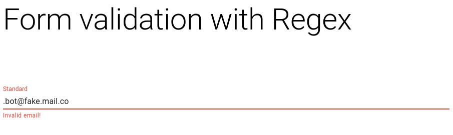
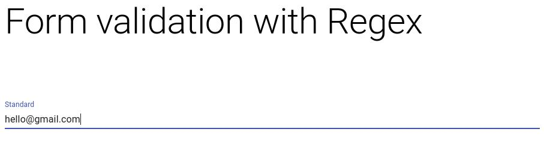

This project is licensed under the terms of the MIT license.

# Email Validation with React, Typescript, Material UI

- I'm creating several components with different email validation methods which
can be reused anywhere.

- I use several input fields to see how different MUI fields look like with 
input validation.

### Notes

- Client side email validation is not an exhaustive security measure. It is 
good for the UX. Email should always be validated on the server side as well.

## Tool versions

Use a tool like [asdf](https://asdf-vm.com/) to control versions. Tool versions can be found in 
.tool-versions

- 16.7.0 for nodejs

# Styling

- Material UI

## First method

- Using regex

### Demo

#### Invalid Input

#### Valid Input

