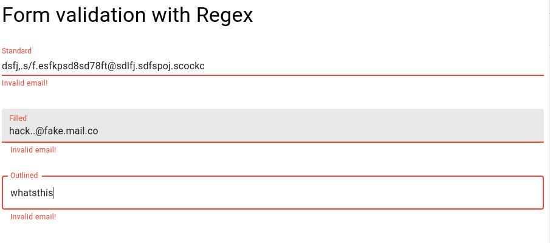
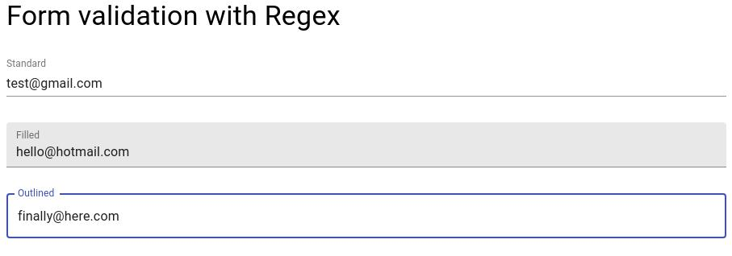

This project is licensed under the terms of the MIT license.

# Email Validation with React, Typescript, Material UI

- I'm creating several components with different email validation methods which
can be reused anywhere.

## Tool versions

Use a tool like asdf to control versions. Tool versions can be found in 
.tool-versions

- 16.7.0 for nodejs

# Styling

- Material UI

## First method

- Using regex

### Demo

#### Invalid Input

#### Valid Input

